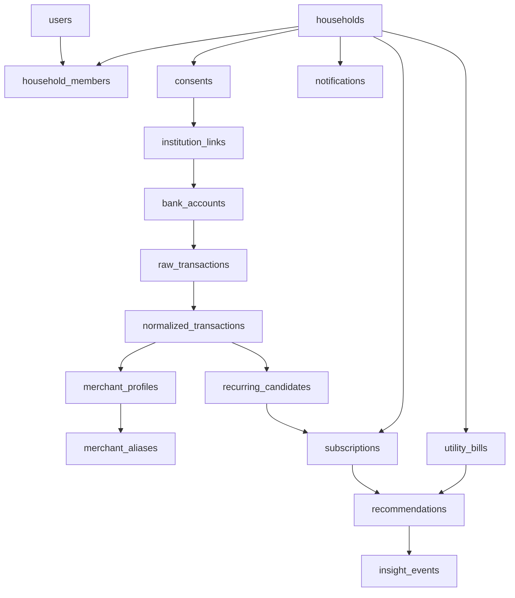

# Data Model Overview

## Purpose

This document defines the recommended high-level data model for `SubSense AI`.

The goal is not to finalize every column up front. The goal is to define the **core fintech entities and boundaries** so the team does not fall into a generic shared-table or oversized helper-module pattern.

## Data modeling principles

1. **Raw financial data is preserved**
   Store original transaction payloads and maintain lineage back to the source.

2. **Normalized views are separate**
   Merchant normalization, recurring detection, and dashboard projections should be built on top of raw data, not instead of it.

3. **Households are first-class**
   The system must represent individual and shared financial contexts from the beginning.

4. **Consent and connection state are auditable**
   Bank link and AA consent lifecycle must be queryable and historically traceable.

5. **Recommendations and insights are evidence-backed**
   Every user-facing recommendation should trace to structured facts.

## Core domain entities

| Domain | Entity | Purpose |
|---|---|---|
| Identity | `users` | base user identity |
| Households | `households` | financial unit under management |
| Households | `household_members` | user membership and role within a household |
| Aggregation | `consents` | AA consent records and lifecycle |
| Aggregation | `institution_links` | institution-level link state and repair status |
| Banking | `bank_accounts` | linked account metadata |
| Transactions | `raw_transactions` | original ingested financial records |
| Transactions | `normalized_transactions` | enriched and standardized transaction views |
| Merchants | `merchant_profiles` | canonical merchant identities |
| Merchants | `merchant_aliases` | statement descriptor variants and mapping rules |
| Recurring | `recurring_candidates` | system-detected recurring patterns before user confirmation |
| Recurring | `subscriptions` | user-confirmed recurring items |
| Recurring | `utility_bills` | recurring essentials and household bills |
| Insights | `recommendations` | deterministic and ranked savings opportunities |
| Insights | `insight_events` | AI-generated or rule-generated explanation records |
| Notifications | `notification_preferences` | user channel settings |
| Notifications | `notifications` | in-app and delivery-tracked alert records |
| Partners | `partner_clients` | future external partners or enterprise tenants |
| Audit | `audit_events` | security, consent, and sensitive action trails |

## Recommended high-level relationships

## Entity guidance

### `users`

Should contain:

- identity basics
- auth provider metadata
- verification state
- lifecycle status

Should not contain:

- household-role information
- bank-link state
- recurring item ownership as embedded columns

### `households`

Should contain:

- household name
- household type
- owner reference
- settings affecting shared analytics and privacy

This is a core product entity, not an optional future add-on.

### `household_members`

Should contain:

- household ID
- user ID
- role
- member status
- privacy scope or access flags where required

This pattern should replace any ad hoc shared-ownership logic.

### `consents`

Should represent:

- consent scope
- purpose
- duration
- state
- revocation information
- source institution or aggregator metadata

This table is central for trust, compliance, and support operations.

### `institution_links`

Should track:

- connection status
- refresh state
- failure reason
- repair-needed state
- last successful sync

This prevents the app from conflating consent artifacts with operational link health.

### `bank_accounts`

Should store:

- account identifiers in safe form
- account type and provider metadata
- household and ownership mapping
- active/inactive state

### `raw_transactions`

This should be the append-only source ledger.

Should include:

- original description
- amount
- direction
- timestamp
- source account
- ingestion batch lineage
- consent and connection lineage

Do not overwrite or discard important source-level detail here.

### `normalized_transactions`

This layer should store:

- normalized merchant candidate
- categorized transaction view
- cleaned descriptors
- duplicate suppression markers
- recurring-analysis metadata

This is the correct place for enrichment, not the raw ledger.

### `merchant_profiles` and `merchant_aliases`

These are critical for recurring-intelligence quality.

They should support:

- canonical merchant identity
- alias and descriptor mapping
- merchant category
- quality or confidence metadata
- future bundle and substitution logic

### `recurring_candidates`

This entity should exist before the confirmed subscription model.

It should allow the system to represent:

- candidate recurring streams
- confidence scores
- reason codes
- suggested ownership
- pending review state

### `subscriptions`

This is the user-facing recurring source of truth.

Should contain:

- merchant
- cadence
- amount
- normalized monthly value
- status
- renewal date
- ownership and sharing flags
- source type such as detected or manual

### `utility_bills`

Utilities should be modeled separately from entertainment subscriptions so the system can support:

- variable monthly values
- due-date tracking
- provider account references
- volatility and seasonality analysis

### `recommendations`

Should store:

- recommendation type
- opportunity value
- confidence
- assumptions
- ranked priority
- partner bias or source flag where relevant

### `insight_events`

Should store:

- insight category
- generated narrative
- supporting evidence references
- freshness timestamp
- user feedback

This enables grounded AI and explainable recommendation history.

### `notifications`

Should store:

- alert type
- delivery state
- channel
- read / dismissed / snoozed state
- trigger lineage

## MVP-only data scope

The MVP does **not** need every future B2B or marketplace entity immediately.

The minimum viable data model should prioritize:

- users
- households
- household_members
- consents
- institution_links
- bank_accounts
- raw_transactions
- normalized_transactions
- merchant_profiles
- recurring_candidates
- subscriptions
- utility_bills
- recommendations
- notifications
- audit_events

## Data model anti-patterns to avoid

- one giant shared database helper file
- runtime creation or mutation of fintech tables during app startup
- embedding household or consent logic in user records
- treating raw and normalized financial data as the same thing
- storing recommendation copy without evidence or traceability

## Final recommendation

SubSense AI should start with a **small but explicit fintech domain model** instead of a broad generic app schema.

The most important architectural choice is not the exact table count. It is preserving:

- clear ownership boundaries
- lineage from source financial data
- household-aware relationships
- explainability for recurring detection and recommendations
- auditable consent and access history
