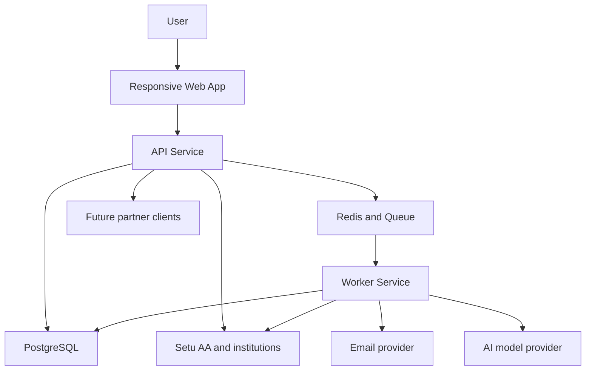

# Integration Landscape

## Purpose

This document defines the integration boundaries for `SubSense AI`.

It complements the solution architecture by answering a more specific question:

How should the platform connect to external systems while preserving fintech trust, recurring-data quality, and future product flexibility?

The goal is to make clear:

- which external systems the MVP depends on
- what responsibilities remain inside the SubSense AI platform
- where asynchronous processing is required
- how fallback and failure states should work
- which boundaries should remain stable as the product grows into partner APIs and embedded distribution

## Integration design principles

1. **Read-only financial connectivity first**
   The MVP should ingest financial data to power visibility and recommendations, not initiate payments or cancellations.

2. **Every integration must degrade gracefully**
   If a bank link fails, a merchant alias is weak, or an AI provider is unavailable, the product must still preserve core manual workflows.

3. **Raw source data and normalized product data must stay distinct**
   External payloads should remain traceable, while user-facing dashboards and insights should rely on normalized internal models.

4. **User trust matters more than automation depth**
   The system should avoid pretending certainty when upstream coverage, normalization quality, or AI confidence is weak.

5. **Async processing is the default for enrichment-heavy work**
   Transaction ingestion, merchant resolution, recurring analysis, alert scheduling, and AI insight generation should all operate through queue-backed workflows.

6. **Integration contracts should be replaceable**
   The platform should be able to add providers, swap vendors, or expand to partner distribution without rebuilding domain logic.

## Landscape summary

| Integration area | Primary external systems | Core purpose | MVP posture | Future evolution |
|---|---|---|---|---|
| Bank connectivity | `Setu AA`, participating financial institutions | ingest consented account and transaction data | critical | add broader provider abstraction if coverage expands |
| Transaction ingestion | provider webhooks, pull refreshes, sync jobs | move source data into raw internal ledgers | critical | stronger replay, reconciliation, and SLA tooling |
| Merchant intelligence | internal rules plus optional external enrichment sources | normalize merchant descriptors and improve recurring quality | critical, mostly internalized | add curated external signals if ROI is clear |
| Notifications | email provider, browser delivery surfaces | renewals, anomalies, and recommendation prompts | critical | add deeper push and messaging channels later |
| AI orchestration | LLM or model providers | generate grounded narratives and ranking support | valuable but non-blocking | add richer routing, personalization, and multilingual support |
| Partner ecosystem | future banks, fintechs, employers, wellness platforms | expose recurring-intelligence capabilities externally | deferred | phase into B2B APIs and white-label components |

## High-level integration map

## Boundary model

### 1. Account Aggregator and bank connectivity

This is the most trust-sensitive external integration in the MVP.

The platform should rely on `Setu AA` or an equivalent Account Aggregator integration for:

- consent initiation
- institution selection and account-link flows
- consent lifecycle updates
- transaction retrieval or refresh orchestration
- webhook or callback-driven status updates

SubSense AI should own:

- household-level consent context
- product-facing consent explanations
- connection health status shown to the user
- refresh scheduling, retry behavior, and stale-state communication
- mapping between bank data, households, and recurring-detection workflows

The AA provider should not own:

- the recurring subscription model
- merchant normalization logic
- household analytics
- savings recommendations
- AI-generated explanations

#### AA boundary expectations

| Concern | Provider responsibility | SubSense AI responsibility |
|---|---|---|
| Consent capture | secure consent initiation and status callbacks | explain purpose, duration, value, and revocation impact |
| Financial data access | provide consented account and transaction payloads | preserve lineage, normalize data, and communicate freshness |
| Link failures | return operational error states | translate into understandable user guidance and fallback actions |
| Coverage gaps | expose institution availability realities | support skip flows and manual recurring setup |

#### Required fallback behavior

If AA connectivity is unavailable, the product must still allow:

- manual subscription setup
- manual utility and bill setup
- dashboard access from user-entered recurring items
- later bank-link retry without losing onboarding progress

### 2. Transaction ingestion and sync boundary

Transaction ingestion is the internal bridge between provider connectivity and product intelligence.

This boundary should support:

- initial sync after consent approval
- scheduled refreshes
- webhook-driven sync events where supported
- replayable ingestion jobs
- deduplication and lineage tracking
- stale-data detection

The ingestion layer should write into raw internal records first and only then trigger downstream enrichment.

#### Ingestion stages

| Stage | Objective | Output |
|---|---|---|
| Retrieval | collect source payloads from consented providers | raw source batches |
| Validation | reject malformed or incomplete records safely | accepted and rejected event logs |
| Persistence | append source transactions with provenance | `raw_transactions` lineage |
| Normalization | standardize descriptors, dates, categories, and account references | `normalized_transactions` views |
| Downstream fan-out | queue recurring detection, insight generation, and alert updates | async work items |

#### Key design rule

No user-facing recommendation should depend directly on untracked provider payloads. Everything shown in product surfaces should flow through durable internal records.

### 3. Merchant normalization and intelligence boundary

Merchant data quality is one of the most important differentiators for recurring-intelligence accuracy.

The platform should treat merchant intelligence as its own boundary rather than burying it inside generic ingestion logic.

It should handle:

- statement descriptor cleanup
- alias grouping
- canonical merchant identity
- subscription category mapping
- utility-provider normalization
- duplicate-service hinting where evidence is strong

#### Preferred operating model

For MVP, merchant intelligence should be primarily internal and deterministic:

- alias rules
- curated merchant mappings
- descriptor similarity heuristics
- category defaults
- confidence scoring

External merchant-enrichment vendors may be considered later, but they should remain optional. The core recurring product should not become dependent on an opaque external merchant taxonomy.

#### Merchant boundary responsibilities

| Capability | External dependency | Internal ownership |
|---|---|---|
| raw descriptor receipt | AA transaction payloads | no |
| alias cleanup and mapping | optional support only | yes |
| recurring-service classification | optional support only | yes |
| duplicate and bundle logic | no | yes |
| merchant quality feedback loop | no | yes |

### 4. Notification and engagement boundary

SubSense AI needs notifications for renewal reminders, price changes, unusual recurring spend, duplicate warnings, and recommendation prompts.

The MVP should support:

- email delivery
- in-app notification center
- browser-driven follow-up flows

This boundary should remain abstract enough that future channels can be added without changing the core recommendation logic.

SubSense AI should own:

- notification eligibility rules
- urgency and relevance ranking
- user preference controls
- suppression and cooldown logic
- delivery logging and auditability

External notification providers should only handle channel delivery.

#### Notification event sources

- subscription renewal dates
- detected amount changes
- stale bank-link conditions
- duplicate subscription findings
- recommendation creation or reprioritization
- unusual recurring pattern detection

#### MVP boundary rule

The product should not depend on native mobile push for habit formation during phase 1. Email and in-app flows must carry the retention model until native expansion is justified.

### 5. AI and insight orchestration boundary

AI should improve explanation quality and prioritization, but it should not be the system of record for recurring truth.

This boundary should be used for:

- natural-language insight generation
- recommendation explanation
- dashboard narrative summaries
- optional conversational finance assistance

This boundary should not be responsible for:

- core consent interpretation
- raw transaction persistence
- deterministic recurring classification by itself
- final user-visible actions without evidence

#### AI boundary model

| Task type | Preferred method | Why |
|---|---|---|
| recurring detection | deterministic logic plus confidence scoring | correctness and explainability matter most |
| merchant normalization | deterministic rules first | stable and auditable output |
| recommendation ranking | rules first with optional learned ranking support | easier to tune and govern |
| narrative explanation | AI-supported | strongest value for summarization and plain-language interpretation |
| chat assistant | grounded retrieval plus AI generation | useful only when responses are evidence-backed |

#### AI provider controls

The orchestration layer should enforce:

- prompt minimization
- removal of unnecessary PII
- structured evidence references
- retry and timeout controls
- provider abstraction so models can change over time
- suppression of low-confidence or weak-value outputs

If the AI provider is unavailable, the product should continue to function through:

- deterministic dashboard metrics
- non-AI alerts
- recommendation cards without generated narratives

### 6. Partner API and ecosystem boundary

Partner integrations are strategically important, but they are not part of the phase-1 MVP.

The architecture should still preserve a clean external boundary from day one so that future partners can consume recurring-intelligence services without forcing major refactors.

Likely partner types include:

- banks
- financial wellness platforms
- employers or benefits platforms
- fintech apps
- personal finance aggregators

#### Partner boundary expectations

| Area | MVP decision | Future-ready requirement |
|---|---|---|
| Tenant isolation | defer | design internal models so partner scoping can be added cleanly |
| External APIs | defer | keep domain services contract-friendly |
| White-label delivery | defer | avoid UX logic entangled with core recurring models |
| SLA commitments | defer | instrument jobs and integration latency from the start |

## Cross-boundary operating requirements

### 1. Observability

Every major integration boundary should support:

- health visibility
- last successful sync state
- error reason capture
- retry visibility
- queue lag tracking for async jobs
- user-visible freshness messaging where applicable

### 2. Security and trust

Every integration boundary should honor:

- encrypted transport
- secret isolation
- audit trails for consent and sensitive actions
- least-privilege access
- PII minimization in logs and AI prompts
- clear revocation and delete handling

### 3. Product-facing transparency

The user experience should never hide upstream integration problems behind vague dashboards.

Users should be able to understand:

- whether their bank link is active
- when data was last refreshed
- whether a recurring item is detected or manually added
- why a recommendation exists
- when an insight is based on weak or incomplete information

## MVP integration priorities

The first integration sequence should be:

1. OTP-based identity and session foundation
2. household-aware onboarding and manual recurring setup
3. `Setu AA` consent and bank-link lifecycle
4. raw ingestion and normalization pipeline
5. merchant intelligence and recurring-detection workflows
6. notification delivery for renewals and key alerts
7. AI-backed narratives layered on top of proven deterministic outputs

This order ensures the product can deliver value even if some automation layers are still maturing.

## Deliberately deferred integrations

The following should remain outside the MVP unless they become essential:

- payment initiation rails
- direct subscription cancellation providers
- broad third-party merchant-enrichment dependence
- native mobile push infrastructure
- real-time card network integrations
- enterprise-grade external API exposure

## Final recommendation

The SubSense AI integration landscape should be built around a small number of durable boundaries:

- Account Aggregator connectivity for consented financial access
- an internal ingestion and normalization backbone
- a dedicated merchant intelligence layer
- abstracted notification delivery
- AI orchestration that enhances, but does not define, recurring truth
- future-ready partner boundaries that remain dormant until the product earns expansion

That approach gives the MVP enough automation to feel premium, while preserving fallback paths, trust, and architectural flexibility.
