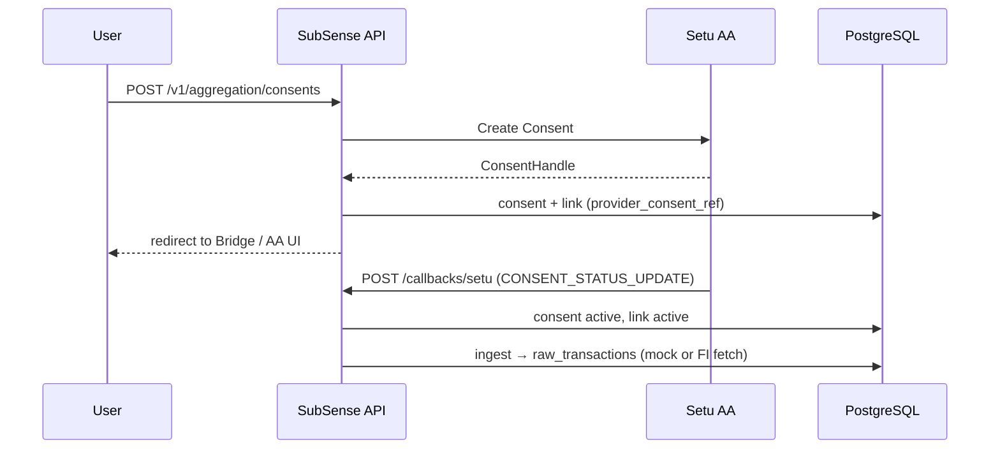
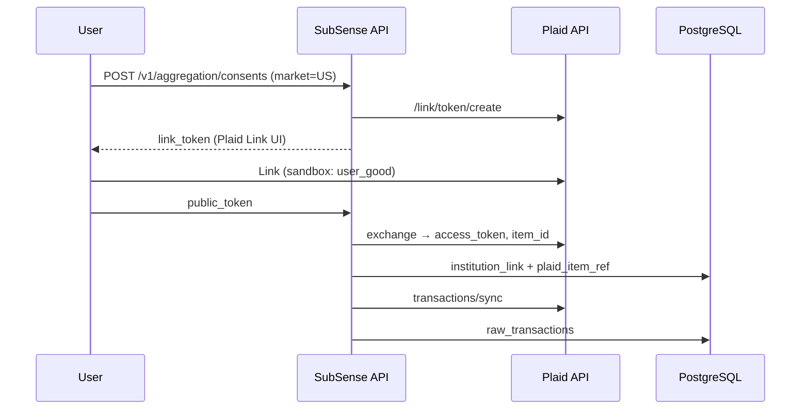

# Multi-market bank aggregation (India + United States)

## Purpose

SubSense must support **two regulated open-finance models** without coupling them:

| Market | Provider (target) | Regulatory / industry model |
|--------|-------------------|-----------------------------|
| **India (`IN`)** | **Setu Account Aggregator** | RBI Account Aggregator framework (FIU ↔ AA ↔ FIP) |
| **United States (`US`)** | **Plaid** (POC / future launch) | US aggregator APIs (Link, Items, Transactions) |

This document defines how both integrations coexist in one codebase, why **Setu is unchanged** when Plaid is added, and how data converges on a **single internal pipeline**.

Implementation status (see also `integration-landscape.md`):

| Provider | Code env | Status |
|----------|----------|--------|
| `mock` | `AGGREGATION_PROVIDER=mock` | Implemented — local dev / demos |
| `setu` | `AGGREGATION_PROVIDER=setu` | Implemented — Create Consent, webhooks, `provider_consent_ref` |
| `plaid` | `AGGREGATION_PROVIDER=plaid` | **Implemented** on `feature/plaid-integration` — Link, exchange, transaction sync |

---

## Core design rule: one adapter slot per deployment, shared domain after ingest

```text
                    ┌─────────────────────────────────────────┐
                    │           SubSense domain core           │
                    │  raw_transactions → normalize → recurring │
                    └────────────────────▲────────────────────┘
                                         │
              ┌──────────────────────────┼──────────────────────────┐
              │                          │                          │
     ┌────────┴────────┐        ┌────────┴────────┐        ┌────────┴────────┐
     │  mock adapter   │        │  setu adapter   │        │ plaid adapter   │
     │  (dev only)     │        │  India / IN     │        │  USA / US       │
     └────────┬────────┘        └────────┬────────┘        └────────┬────────┘
              │                          │                          │
         local simulate            Setu Bridge + AA            Plaid Link + API
```

**India production** must never depend on Plaid. **US production** must never depend on Setu. Selection is by **configuration and household market**, not by replacing shared tables or routes.

---

## Provider adapter registry (backend)

Current (`backend/src/modules/aggregation/aggregation.adapterRegistry.ts`):

```ts
AGGREGATION_PROVIDER === 'plaid'  →  plaidProviderAdapter
AGGREGATION_PROVIDER === 'setu'   →  setuAaProviderAdapter
else                              →  mockSetuProviderAdapter
```

Each adapter implements the same **narrow port** (`AggregationProviderAdapter`):

- `buildConsentRedirect` — start link (Setu: Create Consent + Bridge URL; Plaid: `link_token` + Link UI)
- Provider-specific completion path (Setu: `/v1/aggregation/callbacks/setu`; Plaid: `public_token` exchange — separate routes)

**Setu-specific code stays in:**

- `providers/setuAa.provider.ts`
- `setu/setuAuth.ts`
- `callbackPayload.ts` (Setu `CONSENT_STATUS_UPDATE`)
- `SETU_AA_*` environment variables

**Plaid-specific code** (isolated from Setu):

- `providers/plaid.provider.ts`
- `plaid/plaidClient.ts`, `plaid/plaidExchange.ts`
- `transactions/plaidIngest.ts`, `transactions/plaidCategory.ts` (PFC → normalized category)
- `PLAID_*` environment variables
- `POST /v1/aggregation/plaid/exchange` — **not** mixed into Setu callback handler

---

## Environment and deployment isolation

### Per-environment (recommended for MVP)

| Deployment | `AGGREGATION_PROVIDER` | Credentials |
|------------|------------------------|-------------|
| India staging / prod | `setu` | `SETU_AA_*` only |
| US staging / prod | `plaid` | `PLAID_*` only |
| Local dev (any contributor) | `mock` or `plaid` or `setu` | As needed |

India `.env` **does not require** `PLAID_*`. US `.env` **does not require** `SETU_AA_*`. Missing keys for the **inactive** provider are ignored.

### Per-link sync cadence (platform evolution)

Beyond user-initiated **refresh** and consent-driven ingest, the platform introduces **`link_sync_schedule`** (PostgreSQL, migration `000011`) keyed by `institution_links.id`:

- **Baseline intervals** (initial implementation): `free` ≈ 24h, `premium` ≈ 6h between eligible scheduled pulls—subject to adaptive tuning and product packaging later.
- **After each successful `link.ingest`**, the worker path advances **`next_run_at`** so a future **scheduler** process can scan due rows and enqueue `transaction_ingestion` jobs without coupling to dashboard reads.

Provider webhooks (when added) should still normalize into the same ingest queue; the schedule row prevents “only fresh when the user opens the app.” Full sequencing and test gates: `platform-evolution-implementation-plan.md`.

### Per-household market (future, single global app)

When one app serves both countries:

| Field | Purpose |
|-------|---------|
| `household.market` or `household.region` | `IN` \| `US` |
| Runtime routing | `IN` → setu adapter; `US` → plaid adapter |
| UI | India: AA consent copy, INR; US: Plaid Link, USD |

`AGGREGATION_PROVIDER` may remain a **server default**; household market **overrides** for link creation only.

---

## End-to-end flows (by market)

### India — Setu AA (unchanged architecture)



References: [Setu AA quickstart](https://docs.setu.co/data/account-aggregator/quickstart), `npm run setup:setu`.

### United States — Plaid (implemented)



After `raw_transactions`, the **same** normalization, recurring detection, dashboard, and notifications apply.

---

## Shared internal model (both markets)

These entities and pipelines are **market-agnostic**:

| Layer | Tables / modules | Notes |
|-------|-------------------|--------|
| Consent / link | `consents`, `institution_links` | `provider` field: `setu_aa` or `plaid` |
| Provider reference | `provider_consent_ref` (Setu handle or Plaid `item_id`); `provider_access_token` for Plaid sync (encrypt before prod) | Opaque external id for webhooks and refresh |
| Accounts | `bank_accounts` | Populated after link success (both markets) |
| Ingestion | `raw_transactions` | Same schema; `source_payload` stores provider JSON |
| Enrichment | `normalized_transactions`, `merchant_*`, `recurring_*` | Unchanged |

**Do not** branch recurring logic on Setu vs Plaid — only ingestion and link lifecycle differ.

---

## API surface (stable for frontend)

Existing routes remain the **product contract** for Bank Link:

| Route | India (Setu) | US (Plaid) |
|-------|--------------|------------|
| `POST /v1/aggregation/consents` | Create Consent + Setu redirect | Link token + Plaid Link config |
| `GET /v1/aggregation/consents/:id` | Consent + link state | Same response shape |
| `POST /v1/aggregation/callbacks/setu` | Setu webhooks only | **Not used** in US |
| `POST /v1/aggregation/consents/:id/mock-callback` | Dev mock (India dev) | Dev mock (optional US dev) |
| `POST /v1/aggregation/plaid/exchange` | N/A | Exchange `public_token` |
| `GET /v1/aggregation/consents/:id/plaid-link-token` | N/A | OAuth return / reconnect `link_token` |

Response field `redirect` keeps a consistent shape (`provider_name`, `redirect_url` or link token metadata) so `BankLinkPage` can branch on `provider_name` without breaking India.

---

## Configuration reference

### India (Setu) — see `.env.example`

- `AGGREGATION_PROVIDER=setu`
- `SETU_AA_BASE_URL`, `SETU_AA_CLIENT_ID`, `SETU_AA_CLIENT_SECRET`, `SETU_AA_PRODUCT_INSTANCE_ID`, …
- `AGGREGATION_CALLBACK_SECRET` for `/callbacks/setu`
- Setup: `npm run setup:setu`

### United States (Plaid) — `.env.example` block

- `AGGREGATION_PROVIDER=plaid`
- `PLAID_CLIENT_ID`, `PLAID_SECRET`, `PLAID_ENV=sandbox|production`
- Optional: `PLAID_WEBHOOK_URL` for transaction updates
- No `SETU_AA_*` required

### Development mock (both markets)

- `AGGREGATION_PROVIDER=mock`
- `ENABLE_AGGREGATION_SESSION_MOCK=true` — simulate approval without external provider

---

## What must not change when Plaid is added

To protect the India / Setu path:

1. **Do not modify** `setuAa.provider.ts` behavior except shared bugfixes.
2. **Do not route** Indian users or `AGGREGATION_PROVIDER=setu` through Plaid code paths.
3. **Do not merge** Plaid webhooks into `parseProviderCallbackPayload` for Setu payloads.
4. **Do not remove** `/v1/aggregation/callbacks/setu` or Setu env validation.
5. **Do not change** ReBIT Create Consent body or `SETU_AA_*` names without a migration note.

Plaid work happens on **`feature/plaid-integration`**; merges to `main` require review that India env defaults remain `mock` or `setu`.

---

## Compliance and product boundaries (summary)

| Topic | India | US |
|-------|-------|-----|
| Primary regulation | RBI AA, DPDP | GLBA/state privacy, provider agreements |
| User bank data access | Consent via AA | Consent via Plaid Link |
| Company | Synmora Technologies Pvt. Ltd. (India) | Same entity possible; Plaid onboarding separate |
| POC from US | Setu: Bridge may be geo-blocked; credentials from India team | Plaid Sandbox: personal email OK |

---

## Implementation checklist (Plaid branch)

- [x] Add `plaid` to `AGGREGATION_PROVIDER` enum in `env.ts`
- [x] Implement `plaidProviderAdapter` + `plaidClient`
- [x] Add `POST /v1/aggregation/plaid/exchange` (session-authenticated)
- [x] Map Plaid transactions → `ingestTransactionsForLink` / `raw_transactions` (Plaid links only)
- [x] Map Plaid `personal_finance_category` → `normalized_transactions.category` (`plaidCategory.ts`)
- [x] Frontend: Plaid Link React SDK on Bank Link when `link_token` is returned
- [x] `npm run setup:plaid` — validates Dashboard keys
- [ ] Persist Plaid `transactions/sync` cursor per link (incremental sync)
- [ ] Encrypt `provider_access_token` before production
- [ ] India regression: `AGGREGATION_PROVIDER=setu|mock` smoke tests unchanged

---

## Related documents

- `integration-landscape.md` — external boundaries and fallbacks
- `data-model-overview.md` — domain entities
- `../reference/api-and-data-contracts.md` — API modules
- `../../backups/README.md` — restore code + DB with manifest
