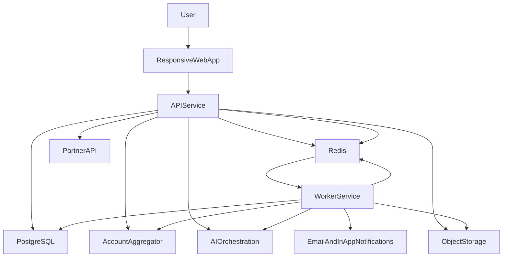

# SubSense AI Solution Architecture

## Purpose

This document defines the recommended target architecture for `SubSense AI` after reviewing the existing `mockcoach` production stack. It answers a practical question:

Should SubSense AI reuse a similar architecture?

The answer is:

- **yes** for infrastructure and operational patterns
- **no** for the current application and data-layer structure

SubSense AI should reuse the proven deployment and async-processing model, while starting with a cleaner fintech domain architecture.

## Architecture decision summary

| Area | Recommendation | Decision |
|---|---|---|
| Hosting and deployment | Keep Railway + Docker initially | Reuse |
| Runtime topology | Keep separate `web` and `worker` services | Reuse |
| Primary database | Keep PostgreSQL | Reuse |
| Queue and background jobs | Keep Redis + BullMQ | Reuse |
| Observability | Keep structured logs, metrics, error tracking | Reuse |
| API framework | Node.js modular monolith is acceptable | Reuse with better boundaries |
| Frontend delivery | Keep web-first, but use a cleaner frontend foundation | Reuse with modernization |
| Shared DB access layer | Do not copy the giant shared SQL module pattern | Replace |
| Runtime schema bootstrap | Do not use runtime DDL for fintech domains | Replace |
| Current SPA route structure | Do not carry forward the broad product shell | Replace |

## Recommended stack

| Layer | Recommended choice | Notes |
|---|---|---|
| Frontend | React + TypeScript + responsive web-first architecture | Keeps team familiarity while improving maintainability |
| UI layer | Mature component system with mobile-first design tokens | MUI is acceptable if the team is already productive with it |
| API layer | Node.js + Express modular monolith | Good for MVP speed if domains are explicitly separated |
| Database | PostgreSQL | Strong fit for ledgers, relationships, reporting, and B2B evolution |
| Queue / jobs | Redis + BullMQ | Suitable for recurring syncs, enrichment, alerts, and AI jobs |
| Cache / transient state | Redis | Useful for streams, rate control, job coordination, and short-lived state |
| File storage | S3-compatible object storage | Good for uploads, consent artifacts, exports, and statement files |
| Deployment | Railway + Docker | Fast iteration for MVP and proven in the existing stack |
| Observability | Pino + Prometheus + Sentry | Strong enough for an early fintech posture |
| API documentation | OpenAPI / Swagger | Important for future B2B API surfaces |

## Core architectural principles

1. **Web-first delivery, mobile-first UX**
   Build the MVP as a mobile-optimized responsive web app. Treat native apps as a later packaging decision, not a phase-one requirement.

2. **Modular monolith first**
   Start with one backend codebase, but split it into clear domains from day one. Avoid a single giant route registry and a single shared data module.

3. **Migration-only schema management**
   All schema evolution should happen through versioned migrations. Do not use runtime DDL bootstrap for finance-critical data.

4. **Append-only raw transaction storage**
   Preserve raw transaction lineage from bank ingestion and build normalized views on top of it.

5. **Async-first processing**
   Treat ingestion, normalization, recurring detection, recommendation generation, alert scheduling, and AI insights as queue-backed workflows.

6. **Security and auditability by default**
   Consent, data freshness, identity changes, and sensitive actions should all be auditable from the beginning.

## Proposed system topology

## Recommended domain modules

| Module | Responsibility | Why it matters |
|---|---|---|
| `auth` | identity, login, OTP verification, session control, step-up auth | separates user security concerns |
| `households` | household entities, members, roles, privacy scopes | core shared-spend model |
| `aggregation` | AA consent state, account linking, link repair, refresh lifecycle | isolates bank integration complexity |
| `transactions` | raw ingestion, normalized ledger, freshness state, reconciliation | foundation for recurring intelligence |
| `merchants` | merchant alias graph, normalization, classification | key to recurring detection quality |
| `subscriptions` | recurring items, utilities, manual entries, statuses | core user-facing recurring system |
| `insights` | recommendation candidates, narratives, ranking, feedback | separates intelligence from ingestion |
| `notifications` | preferences, scheduling, delivery, in-app inbox | supports habit loops and alerts |
| `partners` | external client access, tenanting, API contracts | future B2B API foundation |

## Service responsibilities

### API service

The API service should handle:

- web app requests
- authentication and permissions
- household and recurring item CRUD
- AA consent initiation and connection lifecycle
- dashboard query APIs
- manual actions such as confirm, dismiss, merge, snooze, and save
- partner API request handling

### Worker service

The worker service should handle:

- transaction ingestion retries
- merchant normalization jobs
- recurring detection runs
- alert scheduling and dispatch
- AI insight generation
- benchmark and aggregation jobs
- data export and cleanup flows

## Recommended deployment shape on Railway

| Service | Role | Purpose |
|---|---|---|
| `web` | API + static web app | serves user-facing product and API surface |
| `worker` | BullMQ workers | handles async ingestion, intelligence, and notification work |
| `postgres` | managed DB | source of truth for persistent app data |
| `redis` | managed cache/queue backing | queues, streams, short-lived coordination |

This is very close to the strongest operational pattern from `mockcoach`, and it is a good fit for SubSense AI.

## What to reuse from the existing app

### Reuse directly

- Docker-based deploy flow
- Railway service-role pattern
- Redis + BullMQ job architecture
- health endpoints and metrics
- structured logs and error monitoring
- SSE-style notification delivery approach

### Reuse conceptually, but rebuild

- role-based shared-entity access checks
- auth token validation patterns
- PWA-minded responsive web delivery
- object-storage upload pattern
- Swagger/OpenAPI documentation approach

## What not to reuse directly

### Do not copy the current backend shape

Avoid:

- one large route surface for unrelated domains
- one giant shared database module
- implicit data ownership between modules
- feature accretion without service boundaries

### Do not copy runtime DDL patterns

For SubSense AI, the schema must be:

- migration-driven
- reviewable
- reproducible across environments
- safe for financial-data integrity and audit expectations

### Do not copy the current frontend shape wholesale

Avoid starting with:

- a broad multi-product route tree
- global auth and API behavior entangled in one large context
- older CRA-based scaffolding if you are already starting fresh

## Reuse path from MockCoach

### Option A: Fresh repo, same stack

This is the recommended option.

Benefits:

- no legacy product baggage
- clean fintech domain modeling
- easier security posture from day one
- easier documentation and onboarding for new collaborators

### Option B: Shared deployment patterns, separate codebase

Also acceptable if you want to preserve operational familiarity:

- similar Railway setup
- similar Docker structure
- similar queue and worker model
- separate SubSense application code

### Option C: Extend the current app directly

Not recommended for fintech architecture.

Main risks:

- schema and module sprawl
- mixed domain ownership
- harder security reasoning
- more expensive future B2B API cleanup

## Final recommendation

SubSense AI should adopt a **similar infrastructure architecture** to `mockcoach`, but it should **not inherit the current application architecture** directly.

The right target is:

- mobile-optimized web MVP
- React + TypeScript frontend
- Node.js modular monolith backend
- PostgreSQL + Redis + BullMQ
- Railway + Docker deployment
- explicit fintech domains from day one
- migration-only data management
- future-ready partner API boundaries

That gives you the speed advantages of your proven stack without importing the architectural debt that would be risky in a recurring-finance product.

## Related documents

- `scalability-and-reliability.md` — horizontal scaling, connection and queue discipline, rate limiting expectations, and reliability posture for growth beyond the MVP cohort
