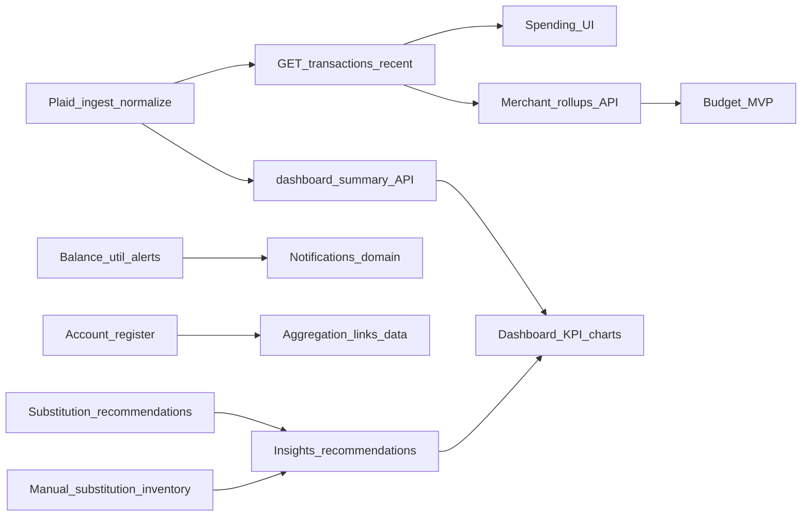

# SubSense vs Rocket Money — positioning, UI audit, and gap prioritization

This document **implements** the gap review against [Rocket Money’s public positioning](https://www.rocketmoney.com/): it records a **confirmed product stance**, a **concrete audit** of what the web app does today (focused on the dashboard and related APIs), and a **ranked backlog** if the org later chooses broader personal-finance-manager (PFM) scope.

## 1. Product positioning (confirmed)

**Decision: SubSense competes on recurring-intelligence depth, not Rocket-style full PFM breadth.**

| Dimension | SubSense (MVP) | Rocket Money (marketing) |
|-----------|----------------|---------------------------|
| Primary job | Surface, review, and act on **recurring** spend (manual + linked), with **recommendations** and **insights** tied to that domain | **All-in-one money app**: subscriptions, spending, budgets, credit, bills, net worth, savings automation |
| Bank data | **Read-only aggregation** (Setu IN / Plaid US per [integration-landscape](../architecture/integration-landscape.md)) | Full account linking for holistic money picture |
| Money movement | **Not in MVP posture** (no transfers, autopilot savings) | Autopilot savings and similar features |
| Human services | **No** concierge cancellation or bill negotiation | Premium human-assisted cancellation and bill negotiation |
| Distribution | **Responsive web MVP** ([frontend-delivery-strategy](../architecture/frontend-delivery-strategy.md)); native apps deferred | Strong **native app** emphasis |

**Implication:** Gaps such as credit bureau, bill negotiation, “cancel for you,” and autopilot savings are **intentional scope boundaries** unless product strategy explicitly expands. They are not “bugs” relative to this positioning.

---

## 2. Dashboard and API audit vs Rocket feature areas

Audit basis: [frontend/src/pages/DashboardPage.tsx](../../frontend/src/pages/DashboardPage.tsx), [frontend/src/pages/NotificationsPage.tsx](../../frontend/src/pages/NotificationsPage.tsx), and shared [frontend/src/lib/api.ts](../../frontend/src/lib/api.ts). [frontend/src/router.tsx](../../frontend/src/router.tsx) lists authenticated routes (`/app/dashboard`, `/app/bank-link`, `/app/notifications`, `/app/ops`). **Target UX when summary data exists:** see **§5.7**.

### 2.1 APIs used from the dashboard

| Method | Path | Purpose |
|--------|------|---------|
| GET | `/v1/insights/dashboard-summary` | Totals, categories, source mix, candidates/recommendations counts, renewals, duplicates, top actions, linked spend trend, freshness |
| GET | `/v1/insights/feed` | Insight feed items (rules / template / ai_grounded) |
| GET | `/v1/recurring` | List recurring subscriptions and utilities |
| GET | `/v1/recurring/candidates` | Pending detected recurring for review |
| POST | `/v1/recurring/subscriptions` | Manual subscription create |
| POST | `/v1/recurring/utilities` | Manual utility create |
| PATCH | `/v1/recurring/subscriptions/:id` | Status (e.g. pause/active) |
| PATCH | `/v1/recurring/utilities/:id` | Status |
| PATCH | `/v1/recurring/candidates/:id` | Edit candidate draft |
| POST | `/v1/recurring/candidates/:id/confirm` | Confirm candidate |
| POST | `/v1/recurring/candidates/:id/dismiss` | Dismiss candidate |
| POST | `/v1/recurring/candidates/:id/merge` | Merge into existing recurring |
| POST | `/v1/insights/recommendations/:id/action` | Accept / dismiss / snooze recommendation |
| GET | `/v1/transactions/recent` | Recent normalized linked transactions for household (see §5; UI under-exposed today) |

### 2.2 APIs used from notifications (related to Rocket “alerts / stay on top”)

| Method | Path | Purpose |
|--------|------|---------|
| GET | `/v1/notifications` | In-app notifications (renewal, anomaly, stale_link, recommendation) |
| GET | `/v1/notification-preferences` | Channel toggles for recommendation / renewal / stale link |

(Additional notification mutation routes exist in `NotificationsPage` for read/dismiss/snooze and preference updates; see that file for full list.)

### 2.3 Rocket feature areas × SubSense status

| Rocket area (public) | SubSense status | Notes |
|---------------------|-----------------|--------|
| Subscription discovery / tracking | **Shipped (dashboard)** | Manual + linked-backed candidates, recurring list, category rollup from summary |
| Subscription cancellation (self-serve) | **Partial** | Recommendations include cancel-type guidance; **no** in-app cancel execution or merchant integrations |
| Assisted / Premium “we cancel for you” | **Missing** | Out of scope per positioning §1 |
| Linked accounts (bank/cards) | **Partial** | Bank link flow exists (`/app/bank-link`); dashboard does not present a full **account register** UI like a PFM shell |
| Investments / full account types | **Missing (UX)** | No dedicated investments view in router; aggregation may ingest broad account types depending on provider—**not** surfaced as Rocket-style “all accounts” |
| Spending insights (general) | **Partial** | `linkedSpendTrend` + category breakdown on dashboard; **not** full merchant-level spend explorer |
| Budgeting / category budgets | **Missing** | No budget caps, envelopes, or dedicated `/app/budget` route |
| Credit score / report | **Missing** | Not in MVP module set |
| Bill negotiation | **Missing** | Not in scope |
| Net worth | **Missing** | No assets/liabilities model in UI |
| Autopilot / automated savings | **Missing** | Read-only posture; no transfers |
| Balance alerts / high spend alerts | **Partial** | Notifications support renewal, anomaly, stale link, recommendation—not evidenced as dedicated **low balance** / **card utilization** alerts in the typed notification list |
| Insight / nudge loops | **Shipped** | Insight feed + recommendations + notifications with deep links to dashboard |
| Native apps | **Missing** | Web-first MVP |

Legend: **Shipped** = clear user-facing capability on current routes; **Partial** = some backend or narrow UI support; **Missing** = no meaningful surface or contradicts MVP posture.

---

## 3. If broadening scope — prioritized gap themes

Use this ordering when **deliberately** expanding toward Rocket-like breadth. **Defer** items that imply payments operations, human concierge, or bill negotiation unless the org accepts compliance and ops cost.

| Priority | Theme | Why | Still defer |
|----------|--------|-----|-------------|
| 1 | **Alert taxonomy** (balance thresholds, spend velocity) | Extends existing notifications domain; improves “stay on top” without new money movement | — |
| 2 | **Budgets** (category limits, progress vs linked spend) | Common PFM step; builds on normalized transactions + dashboard categories | Autopilot transfers |
| 3 | **Net worth** (assets/liabilities inputs + linked balances) | High user expectation for “see everything”; needs clear data model | — |
| 4 | **Credit** (scores/reports, partner integration) | Strong Rocket parity; large compliance and vendor surface | — |
| 5 | **Account / investments shell** | Improves trust and parity on “link everything” story | — |
| — | **Autopilot savings / transfers** | — | **Defer** (money movement, licensing) |
| — | **Bill negotiation** | — | **Defer** (operations + vendor) |
| — | **Human subscription cancellation** | — | **Defer** (operations + liability) |

**Near-term sequencing:** This table is the **strategic priority order**. For **concrete waves** (easy vs medium), **aggregation path**, **substitution intelligence**, and **mandatory test discipline**, see **§5**.

---

## 4. Rocket UX parity vs product scope (web implementation)

The **visual and IA patterns** inspired by [Rocket Money](https://www.rocketmoney.com/) (minimal black/white CTAs, marketing hero + trust copy, sidebar product nav) are implemented in the SubSense **frontend**—without implying feature parity on Premium-only or money-moving capabilities.

**Note:** The left-hand product drawer applies to **authenticated** routes under `/app/...` only. The public **`/onboarding`** sign-up and draft flow does not use `AppLayout` and intentionally has no duplicate Rocket mobile tab bar.

| Area | Implementation notes |
|------|------------------------|
| Theme | Near-black primary buttons, neutral gray page background, red **brand** accent for logo only — [frontend/src/theme.ts](../../frontend/src/theme.ts) |
| Marketing | [LandingPage](../../frontend/src/pages/LandingPage.tsx), [PublicLayout](../../frontend/src/layouts/PublicLayout.tsx) with header; `/learn` — [LearnPage](../../frontend/src/pages/LearnPage.tsx) |
| App shell | Drawer sidebar (Dashboard, Recurring → dashboard `#recurring`, Connect accounts, Alerts; Ops when `VITE_SHOW_OPS_NAV` or dev) — [AppLayout](../../frontend/src/layouts/AppLayout.tsx); see **Phase B (nav backlog)** below |
| Staging chips | `Stage N` dev labels hidden in production unless `VITE_SHOW_STAGE_CHIPS=true` — dashboard and bank link |
| Out of scope for UX clone | Paywall / “pay what’s fair” modal, concierge cancellation, bill negotiation, autopilot savings |

**Phase B (nav backlog, product-approved only):** Add top-level drawer entries and routes for **Spending**, **Transactions**, and **Budget** (e.g. `/app/budget` or equivalent) **only after** dedicated pages exist (see §3 and §5). Do not add nav links to empty placeholder pages.

Section **§3** remains the **strategic** backlog for real feature gaps; **§5** is the **implementation-facing** roadmap (waves, aggregation, tests). This section (§4) is **UX scope** for what is already shipped or allowed in the shell.

---

## 5. Near-term implementation roadmap (additive, low regression risk)

This section turns §3 themes into **delivery waves** that favor **additive** APIs and UI routes, **read-only** posture, and **regression tests** so existing dashboard, bank link, recurring, insights, and notifications keep working.

**Principles**

- Prefer **new routes and stores** over rewriting shared rollup or recommendation logic in the same release; when shared logic must change, add or extend **automated tests** first or in the same PR.
- **Plaid / Setu** remain consent-bound, read-only aggregation (see [integration-landscape](../architecture/integration-landscape.md)).

**Further reading:** [data-model-overview](../architecture/data-model-overview.md) (entities and evolution), [api-and-data-contracts](../reference/api-and-data-contracts.md) (update contract tables when new endpoints or recommendation fields ship).

### 5.1 Aggregation and analysis (Plaid → value)

Linked data flows through **ingestion and normalization** (see [backend transactions module](../../backend/src/modules/transactions/transactions.store.ts) and recurring detection jobs). That pipeline already supports **analysis** beyond the dashboard summary.

| Stage | Status | Notes |
|--------|--------|--------|
| Raw + normalized transactions | **Shipped (backend)** | Normalized rows feed recurring candidates and insights. |
| **GET `/v1/transactions/recent`** | **Shipped (API), under-exposed (UI)** | Session + household scoped; ideal first building block for a **Spending** / **Transactions** page—see Wave A. |
| Dashboard summary + categories | **Shipped** | [Dashboard](../../frontend/src/pages/DashboardPage.tsx) uses insights + recurring APIs; `linkedSpendTrend` is partial spend context. |
| Merchant / time-window rollups | **Planned (Wave B)** | New read aggregations over normalized data (group by merchant descriptor / category, monthly buckets); **read-only**; feeds spending UI and later **budgets**. |
| Tie rollups to recurring + recommendations | **Planned** | Use rollups to enrich copy and assumptions only; no automated money movement. |

### 5.2 Plan switching / cheaper alternatives (substitution intelligence)

Users may expect **concrete options** (e.g. a different carrier or cheaper plan than an incumbent such as T-Mobile). Treat this as **substitution intelligence**, not guaranteed savings.

**Inventory model (implemented, Phase 1):** A **manual substitution inventory** maps recurring **categories** (e.g. `internet`, `utilities`, `streaming`) to a small list of **curated alternatives** (label, price band, region note, disclaimer, `lastVerifiedAt`, `source: manual_catalog`). Implementation: [substitution_inventory.store.ts](../../backend/src/modules/insights/substitution_inventory.store.ts). Open recommendations returned from `GET /v1/insights/dashboard-summary` are **enriched at read time** with optional `alternatives[]` when the recommendation targets a subscription or utility whose category matches inventory—**not** stored on `recommendations` table rows (avoids schema migration for MVP).

**Phase 2:** Move inventory to a **database table** (and optional admin UI); add **scheduled workers** or **allowlisted importers** (partner API, CSV, or targeted fetch) that upsert the same fields. Crawlers, if used, should feed this pipeline—not replace product logic ad hoc.

**Today (recommendation text):** Recommendation types include `cancel`, `downgrade`, `share`, `bundle`, `monitor` ([insights store](../../backend/src/modules/insights/insights.store.ts)). **Downgrade** items remain **generic** copy where inventory does not apply.

**Planned (product- and legal-approved), beyond manual rows:**

- Extend payloads with **optional structured alternatives** from verified sources **or** introduce a new `RecommendationType` (e.g. `substitute`)—update [api-and-data-contracts](../reference/api-and-data-contracts.md) and UI **together**.
- **Data sources** may include curated internal catalog (above), periodically verified public pricing, or **future** partner feeds; every surfaced option must carry **explicit assumptions** per [ai-governance](../architecture/ai-governance.md).
- **Guardrails:** regional accuracy; **no undisclosed** paid placement; dismiss/snooze/accept flows unchanged in spirit; avoid “we save you \$X” absolutes unless consistent with §1 positioning and documented assumptions.
- **BRD** “marketplace” themes apply only as a **future** program; **commercial** offers require an explicit **product/legal** gate.

### 5.3 Wave A — Easy (mostly additive)

| Item | Intent | Main touchpoints | Safety note |
|------|--------|------------------|-------------|
| **Dashboard summary UX (rich state)** | When the household already has recurring/summary data, lead with a **subscription-style** overview: KPI strip, category visualization from existing `byCategory`, and an **action table** from open `recommendations`—see **§5.7** | [DashboardPage](../../frontend/src/pages/DashboardPage.tsx) | **Additive** layout only where possible; do not remove forms/candidates/recurring sections without UX sign-off; label totals as **recurring** where that is what the API measures. |
| **Balance / utilization-style alerts** | Extend “stay on top” without moving money | Notifications domain (§2.2); [NotificationsPage](../../frontend/src/pages/NotificationsPage.tsx); backend notification types/preferences | Add new subtypes/toggles; do not remove existing notification kinds without migration + tests. |
| **Read-only spending / activity UI** | First **Spending** or **Transactions** screen from existing data | **`GET /v1/transactions/recent`** ([transactions.routes.ts](../../backend/src/modules/transactions/transactions.routes.ts)); new page + §4 Phase B nav when ready | Read-only list first; no change to ingestion contract required for v1. |
| **Self-serve cancellation (lightweight)** | Help users act without in-app execution | Dashboard recommendation rows; optional outbound “manage at provider” links | Complements **cancel** / **downgrade** copy; no concierge. |

### 5.4 Wave B — Medium (new surfaces or schema; keep isolated)

| Item | Intent | Main touchpoints | Safety note |
|------|--------|------------------|-------------|
| **Account register (PFM-style)** | Trusting list of linked accounts | [aggregation routes](../../backend/src/modules/aggregation/aggregation.routes.ts) (`/links`, consents); new read APIs as needed; route e.g. `/app/accounts` | **Add** alongside `/app/bank-link`; do not replace link flow. |
| **Budget MVP** | Category caps vs spend | New persistence + API; UI route e.g. `/app/budget` | Run **parallel** to current dashboard categories; avoid rewriting summary rollup in the same release without golden tests. |
| **Merchant / time-window rollups** | Meaningful aggregates for analysis | Query layer over normalized transactions; may power Wave A UI v2 and budgets | Read-only aggregates only. |

### 5.5 Testing discipline (mandatory for feature PRs)

| Step | Command / expectation |
|------|------------------------|
| **Full workspace unit tests** | From repo root: **`npm test`** (runs frontend + backend Vitest via [package.json](../../package.json) workspaces). Run **before merge** on any change that could affect shared behavior. |
| **Types** | **`npm run check`** (or equivalent `typecheck` in each package) for larger refactors. |
| **E2E / routing / auth** | **`npm run test:e2e`** when adding authenticated routes, deep links, or session-critical flows (document as bar in PR template if applicable). |
| **Per feature** | Add or extend **backend** tests (routes, stores, recommendation builders) and **frontend** tests (pages, hooks) for new behavior; match existing patterns in each package. |

### 5.6 Suggested implementation order (for engineers)

**Out of scope for this roadmap (unless §1 changes):** Full **credit**, **net worth**, **autopilot**, **bill negotiation**, **concierge cancel**—see §1 and §3 “Still defer” rows.

### 5.7 Dashboard experience when the user has statistics

When `GET /v1/insights/dashboard-summary` returns meaningful data (`activeItemCount`, `byCategory`, recommendations, etc.), the [Dashboard](../../frontend/src/pages/DashboardPage.tsx) should evolve toward a **clear “subscription / recurring intelligence” story** (conceptually similar to a **Subscription Dashboard** mock: headline metrics, category split, comparisons, and actionable savings rows)—**without** implying unsupported third-party savings figures.

**What exists today (same API, richer presentation possible)**

| Mock / product idea | SubSense field(s) today | Nuance |
|---------------------|-------------------------|--------|
| Monthly total | `summary.totalMonthlyRecurring` | **Recurring-normalized** total, not necessarily all discretionary spend; **label clearly**. |
| “vs last month” | `linkedSpendTrend` (30-day debits vs prior window) | **Linked spend trend**, not strictly “subscription total vs last month” unless product defines that metric. |
| Weekly equivalent | Derive from monthly recurring (e.g. ÷ 4.33) | Cosmetic; same scope as monthly recurring. |
| Potential savings headline | Aggregate open `recommendations[].estimatedMonthlyValue` (optional) | Must surface **assumptions** and avoid “guaranteed savings”; prefer copy like **estimated opportunity** with link to detail. |
| Category donut / bars | `summary.byCategory[]` | **Shipped as data**; add chart component—low API risk. |
| “Household vs national average” bars | **Not in API** | Requires **governed benchmark dataset** (region, methodology, refresh)—see §5.2 and [ai-governance](../architecture/ai-governance.md). **Defer** or substitute with **internal-only** comparisons (e.g. vs prior period on recurring or `linkedSpendTrend`). |
| Action table (“how you can save”) | Open `recommendations[]` (`title`, `message`, `assumptions`, `estimatedMonthlyValue`) | Maps directly; expandable assumptions recommended. |

**Recommended layout (progressive disclosure)**

1. **Hero / KPI strip** when `activeItemCount > 0` (or equivalent “has stats” gate): monthly recurring, optional weekly equivalent, optional **aggregated opportunity** from open recommendations (with disclaimer). Keep **manual vs linked** (`sourceMix`) visible for trust.
2. **Category visualization**: donut or horizontal bar from `byCategory`.
3. **Comparison block**: **Phase 1** — trend from `linkedSpendTrend` or month-over-month recurring if defined; **Phase 2** — external benchmarks only after §5.2 / legal approval.
4. **Recommendations table**: rows for open recommendations; align with §5.2 substitution over time.
5. **Below the fold**: retain existing flows (add subscription/utility, candidates, recurring list, insight feed) so power users and empty states are not blocked.

**Implementation order for this subsection**

1. Donut or bar chart from `byCategory` (UI only).  
2. KPI strip + honest labels.  
3. Recommendations table / denser layout.  
4. Benchmark-style charts last (data + governance).

---

## References

- [solution-architecture](../architecture/solution-architecture.md) — domain modules and principles  
- [data-model-overview](../architecture/data-model-overview.md) — entities and evolution (cross-reference §5 aggregation)  
- [integration-landscape](../architecture/integration-landscape.md) — read-only MVP posture  
- [api-and-data-contracts](../reference/api-and-data-contracts.md) — contract updates when routes or recommendation shapes change  
- [ai-governance](../architecture/ai-governance.md) — explainability and assumptions for recommendations and substitution  
- [frontend-delivery-strategy](../architecture/frontend-delivery-strategy.md) — web-first delivery  
